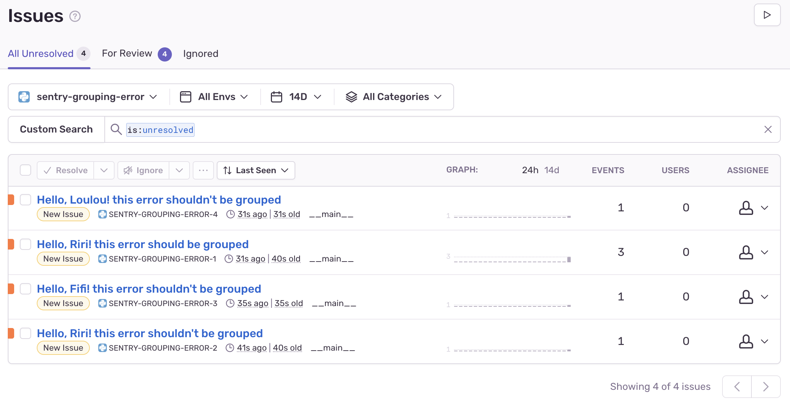

# Sentry Grouping Error Demonstration

## Installation

pip install -r requirements.txt

## Configuration

Create your .env file

```sh
cp .env.template .env
```

and set SENTRY_URL variable

## Run the demonstration

```sh
python grouped_error.py
```

## Conclusion

Here is the result:

f-string (logger.error(f"Hello, {name}! this error shouldn't be grouped")) error are not grouped while string format (logger.error("Hello, %s! this error should be grouped", name)) are

    

